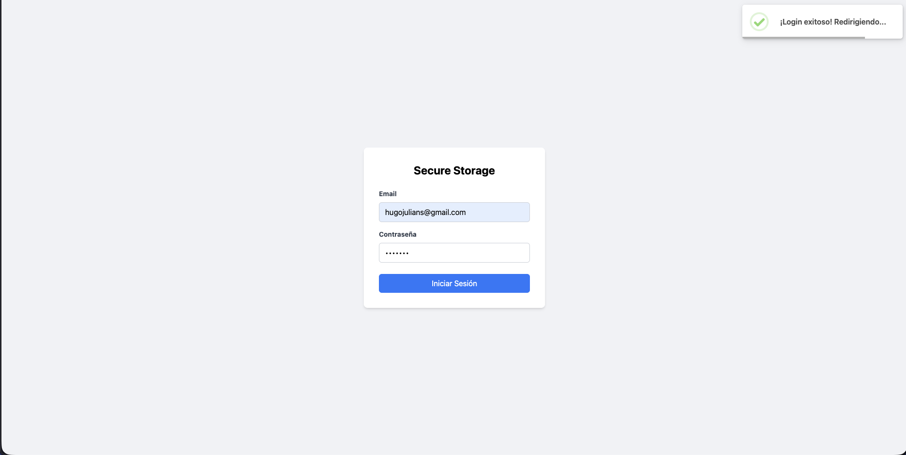
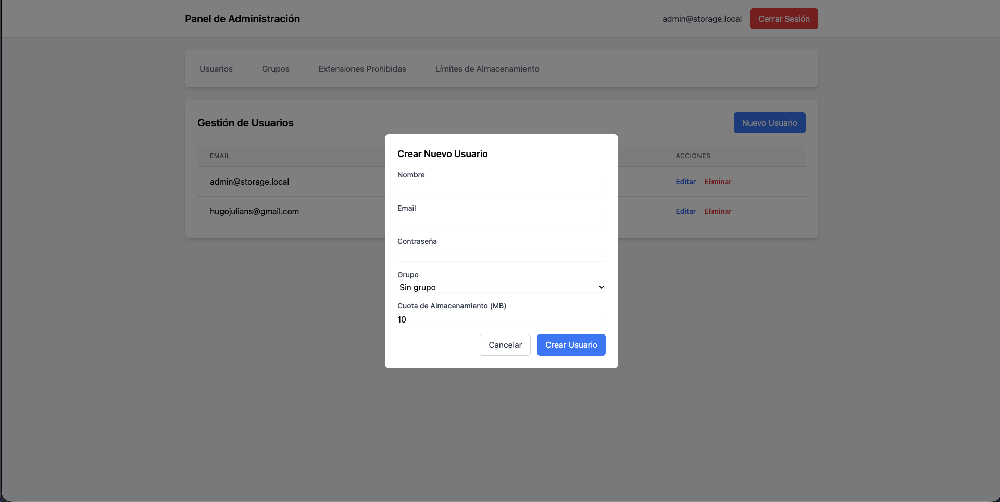
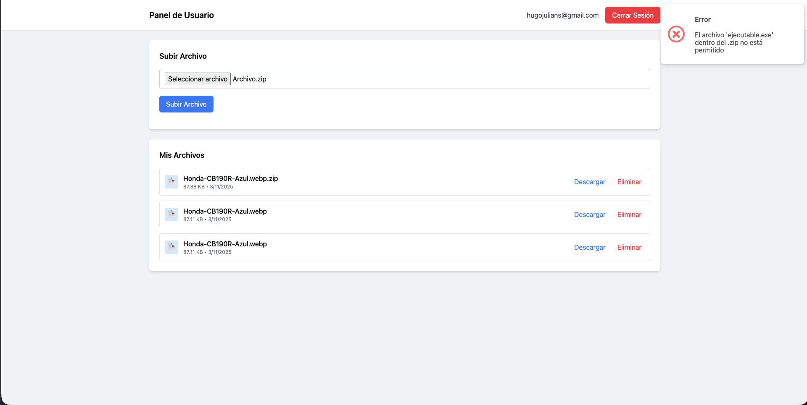

# 📦 Controlador de Almacenamiento Seguro (Laravel 12 + Vanilla JS)

Este proyecto implementa un **sistema de gestión de archivos seguro** con roles de usuario y administrador, desarrollado como parte de una prueba técnica.
El backend fue construido con **Laravel 12** actuando como API REST, y el frontend con **HTML + CSS + Vanilla JavaScript (ES6)**, sin frameworks, ubicado dentro de `public/`.

---

## 🚀 Características principales

### 👥 Roles y Grupos

* **Administrador**: puede gestionar usuarios, grupos, extensiones prohibidas y cuotas de almacenamiento.
* **Usuario**: puede iniciar sesión y subir archivos dentro de su cuota asignada.
* **Grupos**: los administradores pueden crear grupos y asignar usuarios a ellos.

### 💾 Reglas de almacenamiento

* **Cuotas configurables**:

  * Global por defecto (10 MB iniciales).
  * Por grupo.
  * Por usuario (prioridad más alta).
* **Extensiones prohibidas**: configurable desde el panel admin.
* **Escaneo de ZIP**: los `.zip` son analizados antes de aceptarse; si contienen extensiones prohibidas, se rechazan.

### 🧩 Estructura del proyecto

* **Backend** → `/app`, `/routes/api.php`
* **Frontend estático** → `/public`
* **Capturas de interfaz** → `/docs`

---

## 🧠 Decisiones de diseño

1. **Laravel 12 como API**: facilita validaciones, controladores estructurados y servicios reutilizables.
2. **Arquitectura en capas**: se usaron *Requests*, *Services* y *Traits* para separar responsabilidades aunque podría usar arquitectura hexagonal no lo hice debido a que en la prueba no se especificaba.
3. **Frontend en `public/`**: se evitó un framework SPA (como Vue/React) para cumplir con el requerimiento de usar **Vanilla JS**.
4. **Persistencia de configuración**: las cuotas y extensiones prohibidas se almacenan en tablas configurables vía panel admin.
5. **Respuestas unificadas**: uso del trait `ApiResponse` para estandarizar las respuestas JSON.

---

## ⚙️ Instalación y configuración

### 1️⃣ Clonar el repositorio

```bash
git clone
cd storage-admin-backend
```

### 2️⃣ Instalar dependencias

```bash
composer install
npm install
```

### 3️⃣ Configurar variables de entorno

```bash
cp .env.example .env
```


### 4️⃣ Migrar y sembrar base de datos

```bash
php artisan migrate --seed
```

Esto crea las tablas y usuarios de ejemplo.

### 5️⃣ Iniciar el servidor

```bash
php artisan serve
```

El proyecto estará disponible en:
 `http://localhost:8000`

---

## 🔑 Credenciales de prueba

| Rol           | Usuario                                       | Contraseña |
| ------------- | --------------------------------------------- | ---------- |
| Administrador | [admin@storage.local](mailto:admin@storage.local) | admin123   |
| Usuario       | [user@storage.local](mailto:user@storage.local)   | user123   |

---

## Estructura principal

```bash
app/
 ├── Http/Controllers        # Controladores API
 ├── Http/Requests           # Validaciones
 ├── Models                  # Modelos Eloquent
 ├── Services                # Lógica de negocio (cuotas, extensiones, zip)
 └── Traits/ApiResponse.php  # Respuestas JSON estándar

public/
 ├── index.html              # Login de usuario
 ├── admin.html              # Panel de administración
 ├── user.html               # Panel de usuario
 ├── js/                     # Lógica JS (fetch, validaciones, UI)
 └── css/styles.css          # Estilos base

docs/
 ├── login-user.png
 ├── panel-nuevo-usuario.png
 └── archivos-con-exe.png
```

---

## 🧪 Pruebas incluidas

* Validaciones de subida de archivos.
* Escaneo de ZIP con `ZipArchive`.
* Límite de almacenamiento por usuario/grupo/global.
* Control de extensiones prohibidas.
* Autenticación con Laravel Sanctum.

---

## 🖼️ Vista previa

Ubicadas en la carpeta `/docs`:

* inicio de sesión de usuario. 
* gestión desde el panel admin. 
* validación de extensiones no permitidas. 

---

## 🧰 Tecnologías usadas

* **PHP 8.3 + Laravel 12**
* **PostgreSQL**
* **Vanilla JS (ES6)** + Fetch API
* **TailwindCSS** (solo para estilos base)
* **Laravel Sanctum** (autenticación)

---

## 📄 Licencia

Este proyecto fue desarrollado como parte de una **prueba técnica** y puede ser usado con fines educativos o demostrativos.

---
